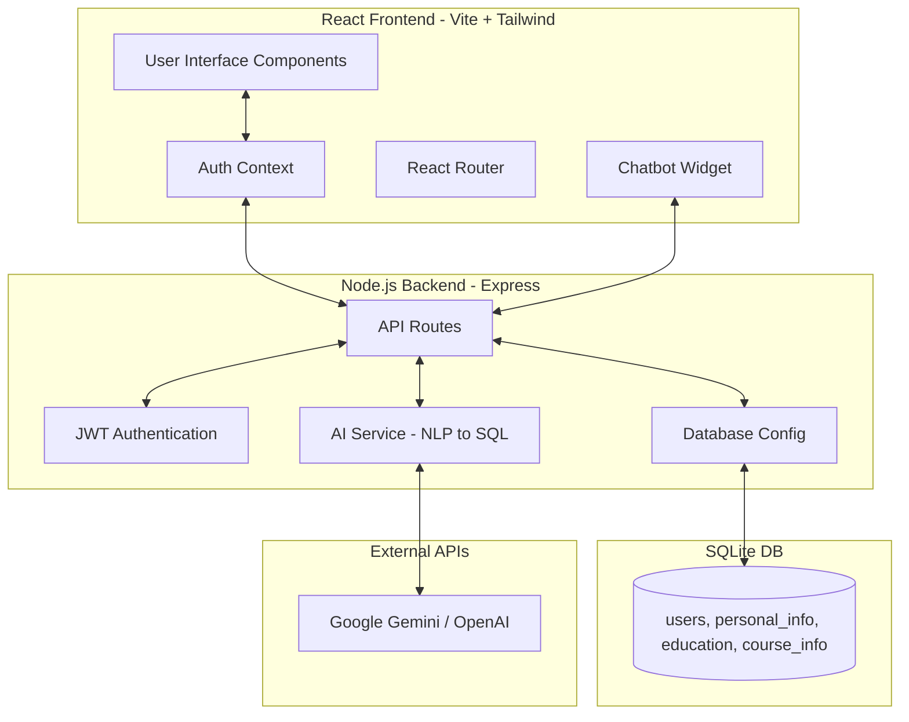

# Low-Level Design (LLD) - ProfileLMS

## 1. System Architecture Diagram

### Text-Based Diagram (ASCII)
```text
+--------------------+        HTTP/JSON        +----------------------+
|  React Frontend    | <=====================> |   Node.js Backend    |
|  (Vite+Tailwind)   |                         |  (Express+SQLite)    |
+---------+----------+                         +----------+-----------+
          |                                               |
          | (Real-time reload)                            | (SQL Gen)
          v                                               v
+---------+----------+                         +----------+-----------+
|   Chatbot Widget   |                         |   Gemini / OpenAI    |
| (Model Selection)  |                         |   (via ai.service)   |
+--------------------+                         +----------------------+
```

### Flowchart Diagram (Mermaid)


## 2. Technology Stack

### Frontend
- **Framework:** React 18, Vite
- **Styling:** Tailwind CSS v4, Glassmorphism UI
- **Typography:** Inter (via `@fontsource/inter`)
- **Icons:** `lucide-react`, `react-icons`
- **Routing:** `react-router-dom`
- **HTTP Client:** Axios
- **Animation:** Framer Motion

### Backend
- **Environment:** Node.js (v20+), Express.js
- **Database:** SQLite3 (`kalviumlabs_forge.sqlite`)
- **Authentication:** JSON Web Tokens (JWT), `bcrypt` for password hashing
- **AI Integration:** `@google/generative-ai` (Gemini), `@langchain/openai`, `openai`
- **Other:** CORS, `dotenv`

## 3. Database Schema

Managed via `src/config/db.js` (SQLite).

### 3.1 `users`
| Column | Type | Constraints | Description |
| :--- | :--- | :--- | :--- |
| `id` | INTEGER | PRIMARY KEY AUTOINCREMENT | Unique user identifier |
| `email` | TEXT | UNIQUE, NOT NULL | User login email |
| `password_hash` | TEXT | NOT NULL | Bcrypt hashed password |

### 3.2 `personal_info`
| Column | Type | Constraints | Description |
| :--- | :--- | :--- | :--- |
| `id` | INTEGER | PRIMARY KEY AUTOINCREMENT | Unique record ID |
| `user_id` | INTEGER | FOREIGN KEY (`users.id`), NOT NULL | Reference to user |
| `name` | TEXT | | User's full name |
| `dob` | TEXT | | Date of birth |
| `gender` | TEXT | | Gender |
| `email` | TEXT | | Contact email |
| `mobile` | TEXT | | Contact mobile number |
| `location` | TEXT | | User's location/address |
| `profile_image` | TEXT | | URL or path to profile picture |

### 3.3 `education`
| Column | Type | Constraints | Description |
| :--- | :--- | :--- | :--- |
| `id` | INTEGER | PRIMARY KEY AUTOINCREMENT | Unique record ID |
| `user_id` | INTEGER | FOREIGN KEY (`users.id`), NOT NULL | Reference to user |
| `board_10` | TEXT | | Class 10th Board Name |
| `percentage_10` | REAL | | Class 10th Percentage |
| `board_12` | TEXT | | Class 12th Board Name |
| `percentage_12` | REAL | | Class 12th Percentage |

### 3.4 `course_info`
| Column | Type | Constraints | Description |
| :--- | :--- | :--- | :--- |
| `id` | INTEGER | PRIMARY KEY AUTOINCREMENT | Unique record ID |
| `user_id` | INTEGER | FOREIGN KEY (`users.id`), NOT NULL | Reference to user |
| `course_enrolled` | TEXT | | Name of the enrolled course |
| `application_status` | TEXT | | Current status of application |
| `courses_count` | INTEGER | DEFAULT 0 | Number of courses |
| `modules_count` | INTEGER | DEFAULT 0 | Number of modules |
| `certificates_count`| INTEGER | DEFAULT 0 | Number of certificates |
| `course_duration` | TEXT | | Duration of the course |
| `course_fee` | TEXT | | Fee details of the course |

## 4. API Contracts

### 4.1 Authentication (`/auth`)
- **`POST /auth/register`**
  - **Body:** `{ email: "...", password: "..." }`
  - **Action:** Creates a new user in `users` table and hashes password.
- **`POST /auth/login`**
  - **Body:** `{ email: "...", password: "..." }`
  - **Returns:** `{ token: "<JWT>", user: { id, email } }`

### 4.2 Profile Management (`/profile`)
*(All protected by Bearer Token)*
- **`GET /profile/me`**
  - **Returns:** `{ personal_info: {}, education: {}, course_info: {} }` scoped by `req.user.id`.
- **`PUT /profile/update`**
  - **Body:** `{ personal_info: {}, education: {}, course_info: {} }`
  - **Action:** Upserts the provided profile data for `req.user.id`.

### 4.3 AI Chatbot (`/chat`)
*(Protected by Bearer Token)*
- **`POST /chat/query`**
  - **Body:** `{ message: "...", model: "gemini|openai" }`
  - **Returns:** `{ reply: "...", success: true, updateOccurred: boolean }`
  - **Action:** Processes natural language via LLM, translates to SQLite queries, executes them (if authorized), and returns conversational response.

## 5. Frontend Architecture & Flow

### 5.1 App Layout
- `App.jsx` handles global routing with React Router.
- `AuthProvider` wraps the `BrowserRouter` to supply global user context (`user`, `login`, `logout`).
- `ProtectedRoute` component intercepts unauthorized access and redirects to `/login`.
- `AuthenticatedLayout` provides the structural shell (including the chatbot widget overlay) inside authenticated routes.

### 5.2 The Profile Dashboard Sidebar
- The `Profile.jsx` features an advanced **Glassmorphism UI** aesthetic using Tailwind CSS (`backdrop-blur-md border border-white/30 shadow-lg`).
- **Typography Scale:** Driven by `Inter`, defining a clear visual hierarchy (Page Title -> `font-semibold text-[42px]`, Sub-headers -> `font-medium text-[18px]`, Large Stats -> `font-normal text-[32px]`).
- Includes interactive elements like a calendar, time tracker SVG animation, responsive grids, and onboarding task widgets.

## 6. NLP -> SQL Mapping Logic (AI Service)

The `ai.service.js` orchestrates natural language to SQL translation. 

1. **Prompt Design:** The LLM is provided the current database schema, context, and the mapped logged-in `user_id`.
2. **Translation:** User input (e.g., *"I got 95% in my 10th grade State Board"*) is mapped strictly to JSON.
   ```json
   {
     "sql": "UPDATE education SET percentage_10 = 95, board_10 = 'State Board' WHERE user_id = {USER_ID}",
     "message": "I've successfully updated your 10th grade details.",
     "updateOccurred": true
   }
   ```
3. **Execution Safety Gate:** 
   - Before executing, the backend ensures the SQL query targets the authenticated user (`WHERE user_id = ?`).
   - Only `SELECT` and `UPDATE` statements are dynamically generated and run.
   - Deletions or unauthorized schema modifications are blocked.
4. **Model Selection:** The platform supports both **Google Gemini 1.5 Flash** and **OpenAI gpt-4o-mini**, dynamically switchable based on configuration and payload parameters.
