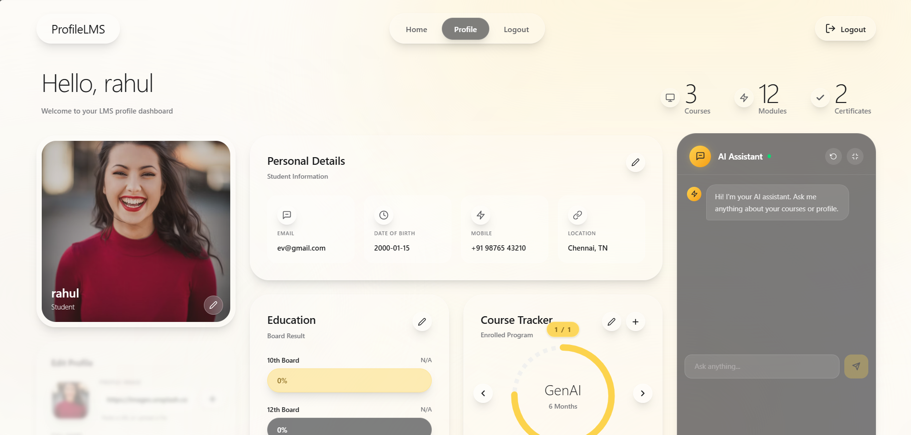

# 💫 AI-Powered LMS Chatbot

# AI-Powered LMS Chatbot Project

An AI-powered agent chatbot capable of updating a user profile within an LMS application, built for the KalviumLabs Forge March 2026 Project.

## Tech Stack
- **Frontend**: React, Vite, Tailwind CSS v4, Axios
- **Backend**: Node.js, Express.js, SQLite3, JSONWebToken, Bcrypt
- **AI Agent**: OpenAI SDK (gpt-4o-mini model strictly translating NL to SQL)

## Links
- **Deployed Project**: [Profile-lms](https://profiles-lms.vercel.app/)
- **Figma Design**: https://www.figma.com/design/zKWtlA2q7uzAKTQnAzVrGn/ProfileLMS?node-id=0-1&t=gy2YVfhbD3qkyKqp-1

## Key Features
1. **Authentication**: JWT-based secure email and password login.
2. **Student Profile**: Custom profile page for reading, updating, and rendering personal and educational details.
3. **AI Chatbot**: A sticky, embeddable floating widget that can answer SQL queries or update your SQLite database directly via Natural Language.
4. **Real-time Sync**: Chatbot state synchronizes immediately with the Profile Page upon successful database modifications.

## How to Run Locally

### Requirements
- Node.js (v18+)
- An OpenAI API Key

### Backend Setup
1. Navigate to the backend directory:
   \`\`\`bash
   cd backend
   \`\`\`
2. Install dependencies:
   \`\`\`bash
   npm install
   \`\`\`
3. Set your environment variables (edit \`.env\` file):
   - Set \`OPENAI_API_KEY=your_real_key_here\`
   - Set \`JWT_SECRET=your_jwt_secret\`
4. Initialize the Mock Database (DO NOT CHANGE SCHEMA):
   \`\`\`bash
   node database/init_db.js
   \`\`\`
5. Start the server:
   \`\`\`bash
   npm start # or node src/server.js
   \`\`\`

### Frontend Setup
1. Open a new terminal and navigate to the frontend directory:
   \`\`\`bash
   cd frontend
   \`\`\`
2. Install dependencies:
   \`\`\`bash
   npm install
   \`\`\`
3. Start the Vite React development server:
   \`\`\`bash
   npm run dev
   \`\`\`

## AI Assistant Usage Statement
This project was developed with the assistance of an AI Code Assistant (Google Gemini Code Assist - Antigravity) for code review, task structuring, scaffolding React components using Tailwind CSS, and ensuring rigid adherence to the SQL generation rules in Node.js.

